# Performance Optimization Dependency Graph

**Date:** 2025-01-27  
**Visual representation of task dependencies across Phase 1-3**

---

## Overview

This document provides visual dependency graphs showing:
- Task dependencies and blocking relationships
- Critical path identification
- Parallel work opportunities
- Implementation sequence recommendations

---

## Complete Dependency Graph

---

## Critical Path Visualization

---

## Dependency Flow by Phase

### Phase 1: Critical Path

### Phase 2: Database & Optimization

### Phase 3: Advanced Features

---

## Parallel Work Streams

---

## Dependency Summary Table

| Task ID | Task Name | Depends On | Can Start | Blocked By |
|---------|-----------|------------|-----------|------------|
| **Phase 1** |
| perf-1.1.1 | Redis Setup | None | ✅ Day 1 | None |
| perf-1.1.2 | Multi-level Cache | perf-1.1.1 | ⚠️ Day 2 | Redis |
| perf-1.3.1 | Parallelize DB Ops | None | ✅ Day 1 | None |
| perf-1.3.2 | Parallelize Search | None | ✅ Day 1 | None |
| perf-2.1.1 | Parallelize Providers | None | ✅ Day 1 | None |
| perf-2.1.2 | Smart Timeouts | None | ✅ Day 1 | None |
| perf-2.1.3 | Unified Cache Check | perf-1.1.1 | ⚠️ Day 2 | Redis |
| perf-2.2.1 | Increase Concurrency | None | ✅ Day 1 | None |
| **Phase 2** |
| perf-1.2.1 | Increase DB Pool | None | ✅ Week 2 | None |
| perf-1.2.2 | Separate Pools | perf-1.2.1 | ⚠️ Week 2 Day 2 | Pool increase |
| perf-1.2.3 | Query Queuing | perf-1.2.2 | ⚠️ Week 2 Day 3 | Separate pools |
| perf-1.2.4 | Supabase Pooling | None | ✅ Week 2 Day 1 | None |
| perf-2.2.2 | Early Termination | Prioritization | ⚠️ Week 2 | Verify scores |
| perf-2.2.4 | Extraction Cache | perf-1.1.1 | ⚠️ Week 2 | Redis |
| perf-2.4.1 | Batch Queries | None | ✅ Week 2 | None |
| perf-2.4.2 | Add Indexes | None | ✅ Week 2 | None |
| perf-2.4.3 | Async Writes | None | ✅ Week 2 | None |
| **Phase 3** |
| perf-1.4.1 | Rate Limit Service | perf-1.1.1 | ⚠️ Week 4 | Redis |
| perf-1.4.2 | Request Queuing | perf-1.4.1 | ⚠️ Week 5 | Rate limiting |
| perf-1.4.3 | Adaptive Rate Limit | perf-1.4.1 | ⚠️ Week 5 | Rate limiting |
| perf-1.3.3 | Progressive Streaming | SSE/WebSocket | ⚠️ Week 5 | Infrastructure |
| perf-1.3.4 | Background Ops | SSE/WebSocket | ⚠️ Week 5 | Infrastructure |
| perf-2.2.3 | Progressive Extraction | SSE/WebSocket | ⚠️ Week 5 | Infrastructure |
| perf-2.2.5 | Batch Extraction | Batch API | ⚠️ Week 5 | API availability |
| perf-2.3.1 | Combine AI Ops | None | ✅ Week 4 | None |
| perf-2.3.2 | Cache AI Decisions | perf-1.1.1 | ⚠️ Week 4 | Redis |
| perf-2.3.3 | AI Batch Processing | Batch API | ⚠️ Week 5 | API availability |
| perf-2.3.4 | Background AI | SSE/WebSocket | ⚠️ Week 5 | Infrastructure |
| perf-2.4.4 | Query Result Cache | perf-1.1.1 | ⚠️ Week 4 | Redis |
| perf-3.1.1 | Per-user Rate Limit | perf-1.4.1 | ⚠️ Week 5 | Rate limiting |
| perf-3.1.2 | Priority Queue | perf-1.1.1 | ⚠️ Week 4 | Redis |
| perf-3.2.1 | Keep Functions Warm | None | ✅ Week 4 | None |
| perf-3.2.2 | Pre-warm Cache | Background Jobs | ⚠️ Week 5 | Infrastructure |
| perf-3.2.3 | Edge Caching | None | ✅ Week 4 | None |
| perf-3.3.1 | Cost Monitoring | None | ✅ Week 4 | None |
| perf-3.3.2 | Global Deduplication | perf-1.1.1 | ⚠️ Week 4 | Redis |
| perf-1.1.3 | Cache Warming | Background Jobs | ⚠️ Week 5 | Infrastructure |

---

## Critical Path Highlight

```mermaid
flowchart TD
    START([Project Start])
    
    CRIT1[🔴 Redis Setup<br/>perf-1.1.1<br/>Day 1]
    CRIT2[🔴 Multi-level Cache<br/>perf-1.1.2<br/>Day 2]
    CRIT3[🔴 Unified Cache Check<br/>perf-2.1.3<br/>Day 2]
    CRIT4[🔴 Extraction Cache<br/>perf-2.2.4<br/>Week 2]
    CRIT5[🔴 Rate Limit Service<br/>perf-1.4.1<br/>Week 4]
    CRIT6[🔴 Request Queuing<br/>perf-1.4.2<br/>Week 5]
    
    START --> CRIT1
    CRIT1 --> CRIT2
    CRIT2 --> CRIT3
    CRIT3 --> CRIT4
    CRIT4 --> CRIT5
    CRIT5 --> CRIT6
    CRIT6 --> END([All Cache-Dependent Tasks Unblocked])
    
    style CRIT1 fill:#ff6b6b,stroke:#c92a2a,stroke-width:4px,color:#fff
    style CRIT2 fill:#ff6b6b,stroke:#c92a2a,stroke-width:3px,color:#fff
    style CRIT3 fill:#ff6b6b,stroke:#c92a2a,stroke-width:3px,color:#fff
    style CRIT4 fill:#ff6b6b,stroke:#c92a2a,stroke-width:3px,color:#fff
    style CRIT5 fill:#ff6b6b,stroke:#c92a2a,stroke-width:3px,color:#fff
    style CRIT6 fill:#ff6b6b,stroke:#c92a2a,stroke-width:3px,color:#fff
```

---

## Legend

- 🔴 **CRITICAL** - Blocks multiple tasks, must be done first
- 🟠 **HIGH** - Important but can be done in parallel
- 🟡 **MEDIUM** - Can be deferred, depends on infrastructure
- ✅ **Can Start** - No dependencies, can begin immediately
- ⚠️ **Blocked** - Has dependencies, must wait

---

## Quick Reference

### Immediate Start (No Dependencies)
- `perf-1.3.1` - Parallelize DB Ops
- `perf-1.3.2` - Parallelize Search
- `perf-2.1.1` - Parallelize Providers
- `perf-2.1.2` - Smart Timeouts
- `perf-2.2.1` - Increase Concurrency
- `perf-1.2.4` - Supabase Pooling
- `perf-2.4.1` - Batch Queries
- `perf-2.4.2` - Add Indexes
- `perf-2.4.3` - Async Writes
- `perf-monitoring-*` - All monitoring tasks

### Must Wait for Redis
- `perf-1.1.2` - Multi-level Cache
- `perf-2.1.3` - Unified Cache Check
- `perf-2.2.4` - Extraction Cache
- `perf-2.3.2` - Cache AI Decisions
- `perf-2.4.4` - Query Result Cache
- `perf-1.4.1` - Rate Limit Service
- `perf-3.1.2` - Priority Queue
- `perf-3.3.2` - Global Deduplication

### Must Wait for Infrastructure
- `perf-1.3.3` - Progressive Streaming (SSE/WebSocket)
- `perf-1.3.4` - Background Ops (SSE/WebSocket)
- `perf-2.2.3` - Progressive Extraction (SSE/WebSocket)
- `perf-2.3.4` - Background AI (SSE/WebSocket)
- `perf-3.2.2` - Pre-warm Cache (Background Jobs)
- `perf-1.1.3` - Cache Warming (Background Jobs)
- `perf-2.2.5` - Batch Extraction (Batch API)
- `perf-2.3.3` - AI Batch Processing (Batch API)

---

**Last Updated:** 2025-01-27

